<div align="center">


<a href="https://git.io/typing-svg"></a>

<p>
  <a href="https://linkedin.com/in/guilherme-carrijo"></a>
  <a href="mailto:carrijoguigui@gmail.com"></a>
  <a href="https://guilherme-carrijo.dev"></a>
</p>

</div>

```bash
$ whoami
guilherme carrijo — full-stack dev desde 2022, estudando pra virar game dev

$ stack --current
vue, quasar, typescript, javascript, python, sql

$ stack --learning
godot, unreal engine 5

$ education
engenharia da computação, puc goiás
```

## Projetos em destaque

| Projeto | Problema que resolve | Stack | Resultado |
|---|---|---|---|
| **[bank-priority-queue-api](https://github.com/oGuiLhotina/bank-priority-queue-api)** | Fila de prioridade para atendimento bancário | NestJS · TypeScript · PostgreSQL | Heap binário próprio, sem lib de fila externa |
| **[folder-tab](https://github.com/oGuiLhotina/folder-tab)** | Nova aba do navegador virando bagunça de favoritos | Vue 3 · Quasar · Vite · `chrome.bookmarks` | Extensão MV3 submetida à Chrome Web Store |

## Atividade

<div align="center">




<picture>
  <source media="(prefers-color-scheme: dark)" srcset="./profile/snake.svg" />
  <source media="(prefers-color-scheme: light)" srcset="./profile/snake-light.svg" />
  
</picture>

</div>

## Stack

**Domino**


**Aprendendo**


## Contato

```bash
$ contact --open
aberto a oportunidades em game dev e desenvolvimento full-stack
```

<p>
  <a href="https://linkedin.com/in/guilherme-carrijo"></a>
  <a href="mailto:carrijoguigui@gmail.com"></a>
</p>
